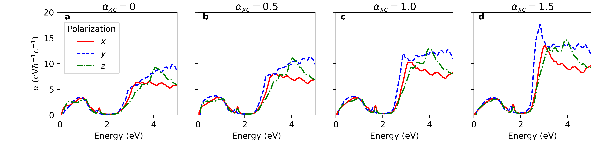
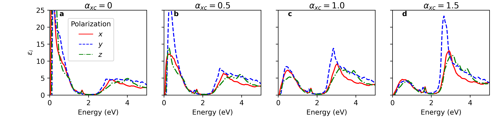
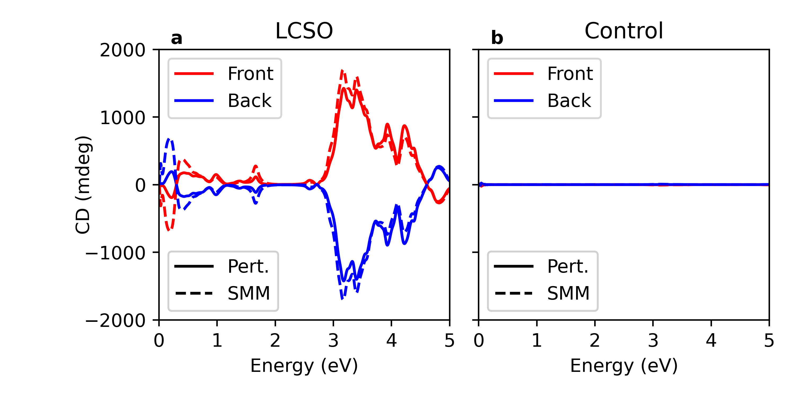
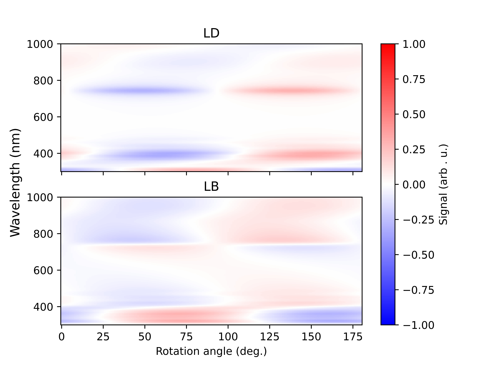

This is a package for modeling the optics of lithium cobalt selenate (LCSO)

From a Python 3.8 environment with pip install, install the requirements via the following:
```bash
pip install -r requirements.txt
```
Ensure that the project root directory is on your path. 

This program is a partial clone of SalijPhDWork (GPLv3) and is distributed under the same license.
This program uses BerreMueller (GPLv3) and yambopy (GPL v2+). Correspondingly, it is distributed under
GPL v3. See the documentation for these packages for more information including that on their dependencies. 

# Figures

“Presented below are the published main text figures and selected SM figures alongside corresponding scripts and datasets

## Figure 1 


A version of Figure 1 and associated .svg files are in `Figures/Figure 1`.
Note that the final figure has been altered from this and has had additional graphical elements added.

## Figure 2 


Relevant data in `Data/Figure_2_data`

## Figure 3


Plotting routine available in `Figures/Thickness_Theory_Exp/plot_thickness_comparison.py`.
Associated theoretical data (scattering matrix method--SMM) `Data/Modeling_Data/SMM_Thickness` and fit data
(see `Scripts/Optics_Scripts/fit_experimental_thickness.py` for fitting routine) in 
`Data/Modeling_Data/Fit_Thickness`. Experimental data in `Data/Raw_Data/Thickness_Exp_Data/LCSO_ACD_thickness_data.xlsx`.

## Figure S1



Plotting routine in `Figures/figure_lrc_xyz_comparison_exp_comparison.py`. Ensure that `plot_abs = True`.
Data is a comparison of absorption coefficients calculated from `Data/Raw_Data/TDDFT/ALDA_PBEsol`, with the 
`o-ALDA_X.eps_q1_inv_alda_dyson` outputs being compared. Note that the raw files require `base_scripts.yambo_parse_scripts`
to be efficiently parsed.
NOTE: There is a bug in `yambopy` prior to April 2024 that prevents correct reading of these files. Update
`yambopy` if you are running into issues there.

## Figure S2


Akin to Figure S1 but with imaginary dielectric functions plotted.
Plotting routine in `Figures/figure_lrc_xyz_comparison_exp_comparison.py`, and ensure that `plot_abs = False`.

## Figure S3


Plotting routine in `Figures/figure_acd_li_control_comparison.py`. TDDFT data in `eps_q1_inv_alda_dyson`
files for X, Y, Z, XY, XZ, and YZ polarizations in `ALDA` directories within `Data/Raw_Data/TDDFT` subfolders
`ALDA_PBEsol` (main "LCSO" compound) and `Li_control_ALDA_PBEsol` (control).
SMM results in `Data/Modeling_Data/SMM_Set_100nm`.

## Figure S4


See `Figures/plot_thickness_comparison_si.py`. Data in `Data/Modeling_Data/SMM_Thickness`.

## Figure S12


See `Scripts/Optics_Scripts/lcso_ld_lb_rotation_heatmap.py` for plotting routine. TDDFT data in 
`Data/Raw_Data/TDDFT/ALDA_PBEsol/ALDA` for `eps_q1_inv_alda_dyson` for X, Y, Z, XY, XZ, and YZ polarizations.

## Figure S13



See `Scripts/Optics_Scripts/lcso_ld_lb_rotation_heatmap.py` for plotting routine. TDDFT data in 
`Data/Raw_Data/TDDFT/ALDA_PBEsol/ALDA` for `eps_q1_inv_alda_dyson` for X, Y, Z, XY, XZ, and YZ polarizations.
Note that Figure S12 is essentially a slice of this figure. 

## Notes

Other SI figure data in `Data/SI_figure_LD_data` and `Data/SI_figure_CD_data`. 